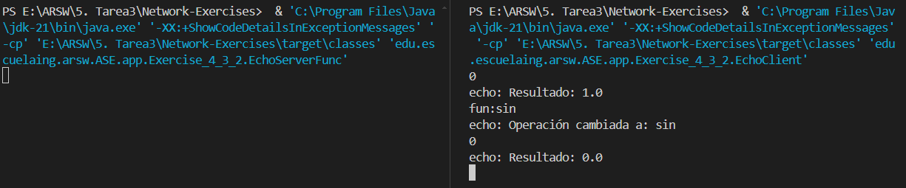

# Network Exercises

The repository will contain a collection of Java programs that address different aspects of network communication using TCP and UDP sockets, as well as the implementation of simple HTTP servers. These programs include clients and servers that perform echo operations, handle basic HTTP requests, and serve static files. The variety of examples provides a solid understanding of the fundamentals of network programming in Java, from simple applications to concurrent servers.

*  **Exercise 1** 

    It is a program in which a URL object is created and prints on the screen each of the data returned by the 8 methods; getProtocol, getAuthority, getHost, getPort, getPath, getQuery, getFile, getRef.

*  **Exercise 2**

    It is a browser application that asks the user for a URL address and reads data from that address and stores it in a file with the name result.html.

*  **Exercise 4.3.1**

    It is a server that receives a number and responds to the square of this number.
    
*  **Exercise 4.3.2**

    It is a server that can receive a number and responds with an operation on this number. This server can receive a message that begins with “fun:”, if it receives this message it changes the operation to those specified. The server must respond to the sine, cosine and tangent functions. By default it should start by calculating the cosine. For example, if the first number you receive is 0, you must respond 1, if you then receive π/2 you must respond 0, if you then receive “fun:sin” you must change the current operation to sine, that is, from that moment on you must calculate sines. If you immediately receive 0, you must respond 0.


*  **Exercise 4.4**

    It is a  web server that serves a request. Deploy the server and try to connect from the browser.

*  **Exercise 4.5.1**

    It is a web server that supports multiple consecutive (non-concurrent) requests. The server returns all requested files, including html pages and images.

*  **Exercise 5.2.1**

    It is a program that uses you to connect to a server that responds to the current time on the server. The program updates the time every 5 seconds based on data from the server. If a time is not received, it maintains the time it had. For the test, the server will be turned off and after a few seconds it will be reactivated. The client continues to run and is updated when the server is up and running again.

*  **Exercise 6.4.1**

    It is an application that can connect to another application of the same type on a remote server using RMI to start a chat. The application requests an IP address and a port before connecting to the desired client. Likewise, it requests a port before starting so that it publishes the object that receives remote calls on that port.


## Getting Started
Download the project from 
[the repository.](https://github.com/Sebasvasquezz/Network-Exercises)

### Prerequisites

* [Maven](https://maven.apache.org/): Automate and standardize the life flow of software construction

* [Git](https://www.git-scm.com/): Decentralized Configuration Manager

### Installing
1. Maven
    * Download Maven in http://maven.apache.org/download.html
    * You need to have Java installed (7 or 8)
    * Follow the instructions in http://maven.apache.org/download.html#Installation

2. Git
    * Download git in https://git-scm.com/download/win
    * Follow the instructions in https://git-scm.com/book/en/v2/Getting-Started-Installing-Git

## Acceptance Tests

The acceptance tests included in this project aim to validate the accuracy and reliability of the network exercises implemented in each of the exercises.

*  **Exercise 1** 

    Run de command:
    ```
    & 'C:\Program Files\Java\jdk-21\bin\java.exe' '-XX:+ShowCodeDetailsInExceptionMessages' '-cp' 'E:\ARSW\5. Tarea3\Network-Exercises\target\classes' 'edu.escuelaing.arsw.ASE.app.Exercise_1.Exercise_1'
    ```
    Execution:
    

    
    
*  **Exercise 2**

    Run de command:
    ```
    & 'C:\Program Files\Java\jdk-21\bin\java.exe' '-XX:+ShowCodeDetailsInExceptionMessages' '-cp' 'E:\ARSW\5. Tarea3\Network-Exercises\target\classes' 'edu.escuelaing.arsw.ASE.app.Exercise_2.Exercise_2'
    ```
    Execution:
    

*  **Exercise 4.3.1**

    Run the commands:
    * To start the server:
        ```
        & 'C:\Program Files\Java\jdk-21\bin\java.exe' '-XX:+ShowCodeDetailsInExceptionMessages' '-cp' 'E:\ARSW\5. Tarea3\Network-Exercises\target\classes' 'edu.escuelaing.arsw.ASE.app.Exercise_4_3_1.EchoServerSquare'
        ```
    * To start the client:
        ```
        & 'C:\Program Files\Java\jdk-21\bin\java.exe' '-XX:+ShowCodeDetailsInExceptionMessages' '-cp' 'E:\ARSW\5. Tarea3\Network-Exercises\target\classes' 'edu.escuelaing.arsw.ASE.app.Exercise_4_3_1.EchoClient'
        ```
        Execution:
        

*  **Exercise 4.3.2**

    Run the commands:
    * To start the server:
        ```
        & 'C:\Program Files\Java\jdk-21\bin\java.exe' '-XX:+ShowCodeDetailsInExceptionMessages' '-cp' 'E:\ARSW\5. Tarea3\Network-Exercises\target\classes' 'edu.escuelaing.arsw.ASE.app.Exercise_4_3_2.EchoServerFunc'
        ```
    * To start the client:
        ```
        & 'C:\Program Files\Java\jdk-21\bin\java.exe' '-XX:+ShowCodeDetailsInExceptionMessages' '-cp' 'E:\ARSW\5. Tarea3\Network-Exercises\target\classes' 'edu.escuelaing.arsw.ASE.app.Exercise_4_3_2.EchoClient'
        ```
        Execution:
        


*  **Exercise 4.4**

    Run de command:
    ```
    & 'C:\Program Files\Java\jdk-21\bin\java.exe' '-XX:+ShowCodeDetailsInExceptionMessages' '-cp' 'E:\ARSW\5. Tarea3\Network-Exercises\target\classes' 'edu.escuelaing.arsw.ASE.app.Exercise_4_4.HttpServer'
    ```
    Execution in browser:
    

*  **Exercise 4.5.1**

    Run de command:
    ```
    & 'C:\Program Files\Java\jdk-21\bin\java.exe' '-XX:+ShowCodeDetailsInExceptionMessages' '-cp' 'E:\ARSW\5. Tarea3\Network-Exercises\target\classes' 'edu.escuelaing.arsw.ASE.app.Exercise_4_5_1.EchoServer'
    ```
    Execution in browser:
    

*  **Exercise 5.2.1**

    Run the commands:
    * To start the server:
        ```
        & 'C:\Program Files\Java\jdk-21\bin\java.exe' '-XX:+ShowCodeDetailsInExceptionMessages' '-cp' 'E:\ARSW\5. Tarea3\Network-Exercises\target\classes' 'edu.escuelaing.arsw.ASE.app.Exercise_5_2_1.DatagramTimeServer'
        ```
    * To start the client:
        ```
        & 'C:\Program Files\Java\jdk-21\bin\java.exe' '-XX:+ShowCodeDetailsInExceptionMessages' '-cp' 'E:\ARSW\5. Tarea3\Network-Exercises\target\classes' 'edu.escuelaing.arsw.ASE.app.Exercise_5_2_1.DatagramTimeClient'
        ```
        Execution:
        

*  **Exercise 6.4.1**

## Build the project
* Run the comand:
    ```
    mvn package
    ```
* Run the application:
    ```
    mvn exec:java -Dexec.args="<pathString>" 
    ```
    or 
    ```
    & 'C:\Program Files\Java\jdk-21\bin\java.exe' '-XX:+ShowCodeDetailsInExceptionMessages' '-cp' 'E:\ARSW\Tarea2\Network-Exercises\target\classes' 'edu.escuelaing.arsw.ASE.app.<folder>.<pathString>'
    ```

## Built With

* [Maven](https://maven.apache.org/) - Dependency Management

## Authors

* **Juan Sebastian Vasquez Vega**  - [Sebasvasquezz](https://github.com/Sebasvasquezz)

## Date

June 21, 2024

## License

This project is licensed under the GNU License - see the [LICENSE.txt](LICENSE.txt) file for details.